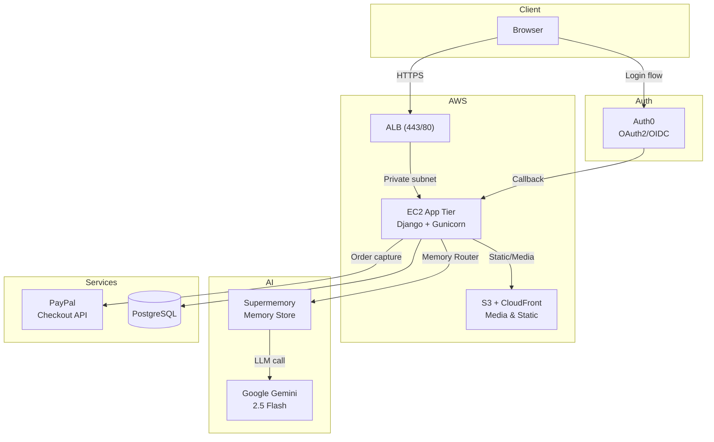

# NMTSA Learn

**Accessibility-first LMS for Neurologic Music Therapy education — built in 36 hours, won 2nd place at Opportunity Hack 2025.**

[](https://python.org)
[](https://djangoproject.com)
[](https://tailwindcss.com)
[](https://auth0.com)
[](https://devpost.com/software/nmtsa-learn)

---

## Overview

NMTSA Learn consolidates scattered Google Drive resources into a secure, trackable online platform for [Neurologic Music Therapy Services of Arizona (NMTSA)](https://devpost.com/software/nmtsa-learn) — a real nonprofit. It serves two audiences:

- **Healthcare professionals** pursuing NMT certification and continuing education (CE) credits
- **Clients and families** accessing free and premium therapy support courses

The platform ships admin-gated teacher verification, a multi-tier AI semantic search engine, autism-friendly accessibility modes, PayPal checkout, PDF certificate generation, and a threaded discussion forum — all in a single Django deployment.

> **Demo video:** [YouTube](https://www.youtube.com/watch?v=1EP4EG3jDYA) · **DevPost:** [nmtsa-learn](https://devpost.com/software/nmtsa-learn)

---

## Highlights

- **Dual-track authentication** — Auth0 OAuth2/OIDC for students and teachers; separate Django session auth for admins, enforced by role-scoped decorators so admin tokens never touch OAuth flows
- **Multi-tier AI search** — Gemini 2.5 Flash via Supermemory Memory Router indexes courses, modules, and lessons independently, then aggregates weighted results (course ×1.0, module ×0.8, lesson ×0.6) with a Django Q text fallback
- **Autism-friendly accessibility** — 4 themes (Light / Dark / High Contrast / Minimal), font-size controls, zero auto-play, Reduce Motion support, and screen-reader modes targeting WCAG 2.1 AA+/AAA
- **Editorial governance** — teachers upload credentials for admin verification before publishing; any edit to a live course auto-unpublishes it and re-queues it for review
- **Production infrastructure** — deployed to AWS EC2 behind an ALB with isolated security groups (only ALB 443/80 reaches the app tier), S3 + CloudFront for media, Auth0 scoped per environment
- **Full SEO surface** — XML sitemaps, Open Graph, Schema.org structured data, and canonical URLs for every published course and teacher profile

---

## Demo / Preview

> **Live demo:** [YouTube walkthrough](https://www.youtube.com/watch?v=1EP4EG3jDYA)

*Screenshots of the student dashboard, AI chat, and accessibility modes would go here. See "Missing Assets" at the bottom of this README.*

---

## Use Cases

| Use Case | User | Outcome |
|----------|------|---------|
| Complete NMT certification modules | Healthcare professional | Tracked progress, CE certificate PDF on completion |
| Find a relevant course via natural language | Student / guest | AI chat surfaces matching courses with direct links |
| Publish and manage course content | Verified teacher | Create video, blog, and PDF lessons; submit for admin review |
| Approve teachers and review courses | Admin | Dedicated dashboard; reject/approve with feedback |
| Purchase a premium course | Student | PayPal checkout unlocks enrollment; idempotent capture |
| Use the platform with sensory sensitivities | Student with autism | Reduce Motion mode, no auto-play, high-contrast themes |

---

## Features

### Courses and Content
- Hierarchical structure: **Course → Module → Lesson**
- Lesson types: **Video** (file upload + transcript), **Blog** (rich text + images), **PDF** (embedded viewer)
- Video resume: stores last playback position per enrollment; completion threshold tracking
- Tagging system via `django-taggit`; rich-text editing via CKEditor 5

### Authentication and Access Control
- OAuth2/OIDC login for students and teachers via Auth0
- Admin-only session login at `/auth/admin-login/` — never shares OAuth tokens
- Role selection on first login → guided onboarding flow → role dashboard
- RBAC decorators: `student_required`, `teacher_required`, `admin_required`, `teacher_verified_required`, `onboarding_complete_required`

### Teacher Workflow
- Resume and certification upload → `pending` verification state
- Admin approves/rejects with rich-text feedback
- Only approved teachers can create or edit courses
- Auto-unpublish on edit triggers fresh admin review cycle

### AI Chat and Semantic Search
- Gemini 2.5 Flash via Supermemory Memory Router: memory context injected automatically per user
- Multi-tier search across courses, modules, and lessons with weighted score aggregation
- Domain-restricted system prompt: assistant only discusses NMTSA platform content
- URL placeholder format (`{COURSE:title}`) resolved to real slugs in responses
- Management commands to seed and sync course content into Supermemory

### Payments and Certificates
- PayPal Checkout (sandbox + live) with idempotent order capture
- PDF certificates generated on course completion with CE credit metadata

### Discussions
- Threaded posts (self-referential FK), pinnable by teacher/admin
- Rate limiting and moderation controls (edit/delete within 24h for students; unrestricted for teacher/admin)

### Accessibility
- 4 UI themes switchable per user preference
- Font-size controls, Reduce Motion mode, screen-reader-friendly markup
- Zero animations, zero auto-play video

### SEO and Localization
- XML sitemaps (static pages, published courses, teacher profiles)
- Open Graph and Schema.org metadata per course
- EN/ES localization support

---

## Tech Stack

| Layer | Technology | Purpose |
|-------|-----------|---------|
| Backend | Python 3.13, Django 5.2 | Web framework, ORM, admin |
| Frontend | Django Templates, Tailwind CSS | Server-rendered UI, utility-first styling |
| Auth | Auth0 (OAuth2/OIDC), Authlib | Student/teacher login; admin uses Django session |
| AI / Search | Supermemory SDK, Google Gemini 2.5 Flash | Memory-augmented chat, semantic course search |
| Payments | PayPal Checkout Server SDK | Course purchases, idempotent order capture |
| Rich Text | CKEditor 5 | Course descriptions, lesson content, transcripts |
| PDF | PyPDF2 | Certificate generation and PDF lesson extraction |
| Video | MoviePy, HTML5 | Video processing utilities, client-side playback |
| Tagging | django-taggit | Course and lesson tagging |
| API | Django REST Framework, SimpleJWT | Chat and search REST endpoints |
| Database | SQLite (dev), PostgreSQL (prod) | Relational data store |
| Infra (prod) | AWS EC2, ALB, VPC, S3, CloudFront | App hosting, media CDN, isolated security groups |

---

## Architecture



### App Modules

```
nmtsa_lms/
├── nmtsa_lms/        # Settings, root URLs, OAuth callback views
├── authentication/   # Custom User model, profiles, onboarding, RBAC decorators
├── teacher_dash/     # Course/Module/Lesson models, review workflow, discussion
├── student_dash/     # Enrollment, progress tracking, video resume
├── admin_dash/       # Teacher verification, course review dashboard
└── lms/              # AI chat, semantic search, sitemaps, course memory sync
```

---

## How It Works

1. **Login** — Student or teacher signs in via Auth0 OAuth2. On first visit, they select a role and complete a short onboarding profile. Admin users log in separately at `/auth/admin-login/`.

2. **Teacher verification** — A teacher uploads their resume and certifications. An admin reviews the submission and approves or rejects with feedback. Only approved teachers can create courses.

3. **Course authoring** — An approved teacher creates a course, adds modules, and attaches video, blog, or PDF lessons. When ready, they submit for admin review. Any subsequent edit auto-resets the course to under-review.

4. **AI indexing** — Running `python manage.py sync_courses_to_memory` pushes every published course, module, and lesson into Supermemory with a slug-based custom ID (enabling idempotent upserts).

5. **Student experience** — After enrolling (free or paid via PayPal), students progress through lessons with video resume, lesson-level completion tracking, and a threaded discussion per course. Completing a course generates a CE certificate PDF.

6. **AI chat and search** — Any user (including guests) can use the chat assistant. Queries route through Supermemory's Memory Router, which injects relevant course memories before calling Gemini 2.5 Flash. A multi-tier search API (`POST /lms/api/courses/search/`) aggregates course, module, and lesson matches with weighted scoring.

---

## Setup

### Prerequisites

- Python 3.13+
- Node.js 18+ and npm
- Auth0 tenant (Domain, Client ID, Client Secret)
- PayPal sandbox credentials
- Supermemory API key
- Google Gemini API key (free tier)

### Install

```bash
git clone https://github.com/2025-Arizona-Opportunity-Hack/Coderz-NMTSAEducationPlatfo.git nmtsa-lms
cd nmtsa-lms
python -m venv .venv
source .venv/Scripts/activate   # Windows; use source .venv/bin/activate on Mac/Linux
pip install -r requirements.txt
cd nmtsa_lms && npm install && cd ..
```

### Environment

Copy `.env.example` to `.env` at the repo root and fill in:

```env
SECRET_KEY=change-me
DEBUG=true
ALLOWED_HOSTS=localhost,127.0.0.1

AUTH0_DOMAIN=your-tenant.us.auth0.com
AUTH0_CLIENT_ID=your-client-id
AUTH0_CLIENT_SECRET=your-client-secret
AUTH0_CALLBACK_URL=http://localhost:8000/callback

PAYPAL_CLIENT_ID=your-sandbox-client-id
PAYPAL_CLIENT_SECRET=your-sandbox-client-secret
PAYPAL_MODE=sandbox

SUPERMEMORY_API_KEY=your-supermemory-key
GEMINI_API_KEY=your-gemini-key
```

### Run

```bash
# Terminal 1 — Django
cd nmtsa_lms
python manage.py migrate
python manage.py createsuperuser   # set role='admin' and onboarding_complete=True in Django admin after login
python manage.py seed_demo_courses  # optional demo data
python manage.py runserver

# Terminal 2 — Tailwind watcher
cd nmtsa_lms
npm run dev
```

Visit `http://127.0.0.1:8000`

**Auth0 setup:** In your Auth0 app settings, set Callback URL to `http://127.0.0.1:8000/callback` and Logout URL to `http://127.0.0.1:8000`.

### Tests

```bash
cd nmtsa_lms
python manage.py test
```

Test suites: `authentication/tests.py`, `teacher_dash/tests.py`, `lms/tests.py`, `student_dash/tests.py`

### Production Build

```bash
cd nmtsa_lms
npm run build
python manage.py collectstatic --noinput
python manage.py migrate
gunicorn nmtsa_lms.asgi:application -k uvicorn.workers.UvicornWorker --bind 0.0.0.0:8000
```

Set `DEBUG=false`, a strong `SECRET_KEY`, `DATABASE_URL` pointing to PostgreSQL, and production Auth0/PayPal credentials.

---

## Usage

### AI Chat API

```bash
# Start a chat
POST /lms/api/chat/rooms/<id>/send/
Content-Type: application/json

{ "content": "What courses do you have on rhythm-based therapy?" }
```

### Semantic Course Search

```bash
POST /lms/api/courses/search/
Content-Type: application/json

{ "query": "neurologic music therapy for stroke rehabilitation" }
```

Returns courses ranked by weighted semantic score across course, module, and lesson indexes.

### Sync Course Content to AI Memory

```bash
cd nmtsa_lms
python manage.py seed_website_memory    # seeds platform info
python manage.py sync_courses_to_memory # indexes all published courses
```

---

## Key Decisions

| Decision | Rationale | Tradeoff |
|----------|-----------|----------|
| Separate admin auth from OAuth | Admins should never share OAuth token scope with students/teachers; prevents privilege escalation via identity provider | Admin UX differs from regular login flow |
| Auto-unpublish on course edit | Prevents unreviewed content from going live after initial approval | Teacher must re-submit every edit; adds friction for minor fixes |
| Multi-tier semantic search with weighted aggregation | A lesson keyword match should surface the parent course; raw lesson scores alone would bury relevant courses | Adds one aggregation step per search; slightly more complex than flat search |
| Supermemory Memory Router over direct LLM call | Injects relevant course memories automatically without custom retrieval code | External dependency; falls back gracefully if unconfigured |
| Slug-based Supermemory custom IDs | Enables idempotent upserts so `sync_courses_to_memory` can run repeatedly without duplicating index entries | Slugs must be stable; regenerating them breaks the index |
| EC2 security groups scoped to ALB only | App tier is unreachable from the public internet; all traffic funneled through ALB with TLS termination | Requires ALB to be correctly configured as the sole ingress |

---

## Innovation / Notable Work

- **Memory Router architecture** — rather than building a bespoke RAG pipeline, the Supermemory Memory Router intercepts Gemini API calls and transparently injects the most relevant course memories from the vector store. The AI assistant is domain-restricted by a system prompt that also normalizes dynamic URLs via a `{COURSE:title}` placeholder format the backend resolves to real slugs.

- **Multi-tier search aggregation** — three parallel Supermemory searches (courses, modules, lessons) feed into a custom aggregator that maps module and lesson hits back to their parent course with priority weighting. This surfaces relevant content even when the student's query matches a specific lesson title rather than the course name.

- **Auto-unpublish governance model** — the editorial pipeline (create → submit → approve → publish → edit → auto-unpublish → re-approve) is enforced at the model save level, not at the view layer, making it robust to API calls and management command usage.

- **Accessibility as a first-class feature** — theme switching, Reduce Motion mode, and zero auto-play are not afterthoughts; they are part of the student profile model (`accessibility_needs` field) and propagate through the template system, targeting WCAG 2.1 AA+/AAA for an autism-friendly experience.

---

## About

Built over 36 hours at **Opportunity Hack 2025 (ASU Fall, Tempe AZ — Oct 11–12)** for a real client: Neurologic Music Therapy Services of Arizona. NMTSA's content was previously scattered across Google Drive with no enrollment tracking, no payment infrastructure, and no accessibility accommodations. This platform addresses all three while adding an AI assistant that understands the course catalog.

**Awards:** Winner — Completion Support Prize (Education Platform, 2nd Place) · Winner — Best Polish

**Team:** Coderz — Aakash Khepar & Aditya Jindal

**Links:** [DevPost](https://devpost.com/software/nmtsa-learn) · [Demo Video](https://www.youtube.com/watch?v=1EP4EG3jDYA)
